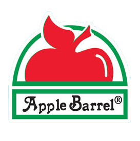
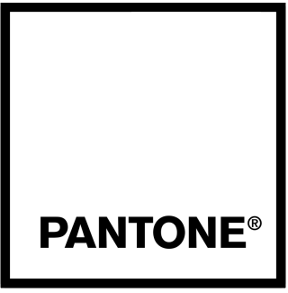

# Miniature Paints RGB values

List of miniature paints scraped by the [Miniature Painter Pro](https://miniaturepainterpro.app/) team

Feel free to use or improve any of these paints in your own personal projects.

## Paints by brand

<!--- START -->
|  |  |  |
| :---: | :---: | :---: |
|  |  |  |
|  |  |  |
|  |  |  |
|  |  |  |
|  |  |  |
|  |  |  |
|  |  |  |
|  |  |
<!--- END -->

## About [Miniature Painter Pro](https://miniaturepainterpro.app/)
Miniature Painter Pro is for created for all your miniature painting joys. This tool has been developed to aid miniature painters in their quest for the perfect paint color. Use the color picker, save your paints in a palette, compare paints across brands and find complementary colors. When colors are missing from your own supply, you can compare them cross-brand or even mix them with existing paints you own.

FEATURES
- pick colors from images and/or photos
- organise paints in your own palettes
- compare colors cross-brand (20+ brands now available)
- mix colors from your own paint supply
- easily find complementary colors in different triads
- updated regularly

