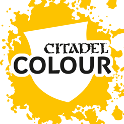

# Citadel Colour

|Name|Set|R|G|B|Hex|
|---|---|---|---|---|---|
|'Ardcoat|Technical|249|249|249| `#F9F9F9`|
|Abaddon Black|Air|0|0|0| `#000000`|
|Abaddon Black|Base|0|0|0| `#000000`|
|Adeptus Battlegrey|Foundation (discontinued)|74|76|88| `#4A4C58`|
|Administratum Grey|Layer|152|156|148| `#989C94`|
|Administratum Grey|Air|143|150|144| `#8F9690`|
|Aethermatic Blue|Contrast|28|126|146| `#1C7E92`|
|Aggaros Dunes|Contrast|112|101|66| `#706542`|
|Agrax Earthshade|Shade|169|157|141| `#A99D8D`|
|Agrax Earthshade Gloss|Shade|180|170|158| `#B4AA9E`|
|Agrellan Badland|Technical|179|158|128| `#B39E80`|
|Agrellan Earth|Technical|179|158|128| `#B39E80`|
|Ahriman Blue|Layer|0|112|138| `#00708A`|
|Air Caste Thinner|Air|249|249|249| `#F9F9F9`|
|Akhelian Green|Contrast|0|79|99| `#004F63`|
|Alaitoc Blue|Layer|47|79|133| `#2F4F85`|
|Altdorf Guard Blue|Layer|45|70|150| `#2D4696`|
|Angron Red Clear|Air|226|24|35| `#E21823`|
|Apothecary White|Contrast|165|190|212| `#A5BED4`|
|Armageddon Dunes|Technical|232|211|111| `#E8D36F`|
|Armageddon Dust|Technical|210|173|0| `#D2AD00`|
|Astorath Red|Dry|169|49|30| `#A9311E`|
|Astrogranite|Technical|118|118|117| `#767675`|
|Astrogranite Debris|Technical|157|157|157| `#9D9D9D`|
|Astronomicon Grey|Foundation (discontinued)|147|171|175| `#93ABAF`|
|Asurmen Blue Wash|Foundation Wash (discontinued)|39|62|81| `#273E51`|
|Athonian Camoshade|Shade|182|183|136| `#B6B788`|
|Auric Armour Gold|Layer|255|196|81| `#FFC451`|
|Averland Sunset|Air|251|184|28| `#FBB81C`|
|Averland Sunset|Base|251|184|28| `#FBB81C`|
|Baal Red Wash|Foundation Wash (discontinued)|99|8|8| `#630808`|
|Bad Moon Yellow|Foundation (discontinued)|255|242|0| `#FFF200`|
|Badab Black Wash|Foundation Wash (discontinued)|0|0|0| `#000000`|
|Baharroth Blue|Layer|84|189|202| `#54BDCA`|
|Balor Brown|Layer|135|84|8| `#875408`|
|Balor Brown|Air|135|84|8| `#875408`|
|Balthasar Gold|Air|167|115|83| `#A77353`|
|Balthasar Gold|Base|167|115|83| `#A77353`|
|Baneblade Brown|Air|143|124|104| `#8F7C68`|
|Baneblade Brown|Layer|143|124|104| `#8F7C68`|
|Barak-Nar Burgundy|Base|69|22|54| `#451636`|
|Basilicanum Grey|Contrast|33|33|33| `#212121`|
|Beaten Copper|Foundation (discontinued)|115|55|45| `#73372D`|
|Bestial Brown|Foundation (discontinued)|123|74|57| `#7B4A39`|
|Bestigor Flesh|Layer|208|137|81| `#D08951`|
|Biel-Tan Green|Shade|125|165|122| `#7DA57A`|
|Bilious Green|Foundation (discontinued)|169|209|113| `#A9D171`|
|Black Ink|Foundation (discontinued)|0|0|0| `#000000`|
|Black Legion|Contrast|35|35|36| `#232324`|
|Black Templar|Contrast|23|23|23| `#171717`|
|Blazing Orange|Foundation (discontinued)|230|89|37| `#E65925`|
|Bleached Bone|Foundation (discontinued)|238|213|172| `#EED5AC`|
|Blood Angels Red|Contrast|134|11|14| `#860B0E`|
|Blood For The Blood God|Technical|96|1|6| `#600106`|
|Blood Red|Foundation (discontinued)|210|34|62| `#D2223E`|
|Bloodletter|Glaze|243|115|85| `#F37355`|
|Bloodreaver Flesh|Layer|106|72|72| `#6A4848`|
|Blue Horror|Layer|158|181|206| `#9EB5CE`|
|Boltgun Metal|Foundation (discontinued)|136|135|137| `#888789`|
|Brass Scorpion|Layer|166|93|44| `#A65D2C`|
|Brazen Brass|Foundation (discontinued)|150|103|71| `#966747`|
|Bronzed Flesh|Foundation (discontinued)|236|154|54| `#EC9A36`|
|Bubonic Brown|Foundation (discontinued)|184|145|66| `#B89142`|
|Bugman Glow|Base|128|76|67| `#804C43`|
|Burnished Gold|Foundation (discontinued)|224|192|104| `#E0C068`|
|Cadian Fleshtone|Layer|196|118|82| `#C47652`|
|Caledor Sky|Air|54|102|153| `#366699`|
|Caledor Sky|Base|54|102|153| `#366699`|
|Calgar Blue|Air|42|73|127| `#2A497F`|
|Calgar Blue|Layer|42|73|127| `#2A497F`|
|Caliban Green|Base|0|61|21| `#003D15`|
|Caliban Green|Air|0|61|21| `#003D15`|
|Calth Blue Clear|Air|0|135|209| `#0087D1`|
|Calthan Brown|Foundation (discontinued)|122|66|49| `#7A4231`|
|Camo Green|Foundation (discontinued)|135|141|82| `#878D52`|
|Canoptek Alloy|Layer|195|178|172| `#C3B2AC`|
|Carroburg Crimson|Shade|190|128|164| `#BE80A4`|
|Cassandora Yellow|Shade|245|204|146| `#F5CC92`|
|Castellan Green|Air|38|71|21| `#264715`|
|Castellan Green|Base|38|71|21| `#264715`|
|Castellax Bronze|Air|198|131|81| `#C68351`|
|Castellax Bronze|Layer|198|131|81| `#C68351`|
|Catachan Fleshtone|Base|68|43|37| `#442B25`|
|Catachan Green|Foundation (discontinued)|69|84|64| `#455440`|
|Celestra Grey|Base|139|163|163| `#8BA3A3`|
|Chainmail|Foundation (discontinued)|142|140|145| `#8E8C91`|
|Changeling Pink|Dry|243|171|202| `#F3ABCA`|
|Chaos Black|Foundation (discontinued)|0|21|34| `#001522`|
|Chaos Black|Spray|0|0|0| `#000000`|
|Charadon Granite|Foundation (discontinued)|70|63|57| `#463F39`|
|Chemos Purple|Air|79|53|108| `#4F356C`|
|Chronus Blue|Dry|75|144|207| `#4B90CF`|
|Codex Grey|Foundation (discontinued)|128|130|133| `#808285`|
|Coelia Greenshade|Shade|27|143|133| `#1B8F85`|
|Commando Khaki|Foundation (discontinued)|154|140|123| `#9A8C7B`|
|Contrast Medium|Technical|249|249|249| `#F9F9F9`|
|Corax White|Base|255|255|255| `#FFFFFF`|
|Corax White|Spray|255|255|255| `#FFFFFF`|
|Corvus Black|Air|23|19|20| `#171314`|
|Corvus Black|Base|23|19|20| `#171314`|
|Creed Camo|Contrast|20|93|46| `#145D2E`|
|Cryptek Armourshade Gloss|Shade|133|106|103| `#856A67`|
|Cygor Brown|Contrast|62|26|23| `#3E1A17`|
|Daemonette Hide|Base|101|95|129| `#655F81`|
|Dark Angels Green|Contrast|0|17|15| `#00110F`|
|Dark Angels Green|Foundation (discontinued)|25|85|60| `#19553C`|
|Dark Flesh|Foundation (discontinued)|104|59|49| `#683B31`|
|Dark Green Ink|Foundation (discontinued)|16|132|115| `#108473`|
|Dark Reaper|Layer|53|77|76| `#354D4C`|
|Darkoath Flesh|Contrast|152|97|91| `#98615B`|
|Dawnstone|Dry|105|112|104| `#697068`|
|Dawnstone|Air|105|112|104| `#697068`|
|Dawnstone|Layer|105|112|104| `#697068`|
|Death Guard Green|Spray|85|98|41| `#556229`|
|Death Guard Green|Base|109|119|77| `#6D774D`|
|Death Korps Drab|Air|61|69|57| `#3D4539`|
|Death Korps Drab|Base|61|69|57| `#3D4539`|
|Deathclaw Brown|Layer|175|99|79| `#AF634F`|
|Deathclaw Brown|Air|175|99|79| `#AF634F`|
|Deathshroud Clear|Air|28|28|27| `#1C1C1B`|
|Deathworld Forest|Base|85|98|41| `#556229`|
|Deathworld Forest|Air|85|98|41| `#556229`|
|Dechala Lilac|Layer|181|152|201| `#B598C9`|
|Deepkin Flesh|Layer|169|183|159| `#A9B79F`|
|Desert Yellow|Foundation (discontinued)|156|136|85| `#9C8855`|
|Devlan Mud Wash|Foundation Wash (discontinued)|57|49|33| `#393121`|
|Dheneb Stone|Foundation (discontinued)|184|172|160| `#B8ACA0`|
|Doombull Brown|Layer|87|0|3| `#570003`|
|Dorn Yellow|Layer|255|245|90| `#FFF55A`|
|Drakenhof Nightshade|Shade|161|165|175| `#A1A5AF`|
|Druchii Violet|Shade|143|101|146| `#8F6592`|
|Dryad Bark|Base|43|42|36| `#2B2A24`|
|Dryad Bark|Air|43|42|36| `#2B2A24`|
|Dwarf Bronze|Foundation (discontinued)|162|104|64| `#A26840`|
|Dwarf Flesh|Foundation (discontinued)|218|147|130| `#DA9382`|
|Eidolon Purple Clear|Air|125|77|153| `#7D4D99`|
|Eldar Flesh|Dry|232|192|127| `#E8C07F`|
|Elf Flesh|Foundation (discontinued)|237|174|116| `#EDAE74`|
|Elysian Green|Layer|107|140|55| `#6B8C37`|
|Elysian Green|Air|107|140|55| `#6B8C37`|
|Emperor Children|Layer|183|64|115| `#B74073`|
|Enchanted Blue|Foundation (discontinued)|0|113|183| `#0071B7`|
|Eshin Grey|Layer|72|75|78| `#484B4E`|
|Etherium Blue|Dry|158|181|206| `#9EB5CE`|
|Evil Sunz Scarlet|Layer|192|20|17| `#C01411`|
|Evil Sunz Scarlet|Air|192|20|17| `#C01411`|
|Fenrisian Grey|Layer|109|148|179| `#6D94B3`|
|Fenrisian Grey|Air|109|148|179| `#6D94B3`|
|Fenrys Grey|Foundation (discontinued)|44|67|99| `#2C4363`|
|Fiery Orange|Foundation (discontinued)|244|121|32| `#F47920`|
|Fire Dragon Bright|Layer|244|135|78| `#F4874E`|
|Flash Gitz Yellow|Air|255|243|0| `#FFF300`|
|Flash Gitz Yellow|Layer|255|243|0| `#FFF300`|
|Flayed One Flesh|Layer|238|196|131| `#EEC483`|
|Flesh Tearers Red|Contrast|75|4|2| `#4B0402`|
|Flesh Wash|Foundation Wash (discontinued)|206|140|66| `#CE8C42`|
|Fortress Grey|Foundation (discontinued)|188|189|192| `#BCBDC0`|
|Fuegan Orange|Shade|187|118|72| `#BB7648`|
|Fulgrim Pink|Layer|243|171|202| `#F3ABCA`|
|Fulgurite Copper|Layer|206|141|81| `#CE8D51`|
|Fyreslayer Flesh|Contrast|114|78|60| `#724E3C`|
|Gal Vorbak Red|Base|75|33|60| `#4B213C`|
|Gal Vorbak Red|Air|75|33|60| `#4B213C`|
|Gauss Blaster Green|Layer|127|193|165| `#7FC1A5`|
|Gehenna Gold|Layer|201|107|24| `#C96B18`|
|Genestealer Purple|Air|118|88|165| `#7658A5`|
|Genestealer Purple|Layer|118|88|165| `#7658A5`|
|Ghostly Grey|Foundation (discontinued)|195|198|205| `#C3C6CD`|
|Goblin Green|Foundation (discontinued)|61|147|83| `#3D9353`|
|Golden Griffon|Dry|225|186|127| `#E1BA7F`|
|Golden Yellow|Foundation (discontinued)|255|194|14| `#FFC20E`|
|Golgfag Brown|Dry|143|80|42| `#8F502A`|
|Gore-Grunta Fur|Contrast|97|59|31| `#613B1F`|
|Gorthor Brown|Layer|95|70|63| `#5F463F`|
|Graveyard Earth|Foundation (discontinued)|102|82|56| `#665238`|
|Gretchin Green|Foundation (discontinued)|126|105|48| `#7E6930`|
|Grey Knights Steel|Air|176|189|198| `#B0BDC6`|
|Grey Knights Steel|Base|176|189|198| `#B0BDC6`|
|Grey Seer|Base|162|165|167| `#A2A5A7`|
|Grey Seer|Spray|162|165|167| `#A2A5A7`|
|Gryph-Charger Grey|Contrast|37|105|138| `#25698A`|
|Gryph-Hound Orange|Contrast|148|48|14| `#94300E`|
|Gryphonne Sepia Wash|Foundation Wash (discontinued)|132|57|16| `#843910`|
|Guilliman Blue|Glaze|47|154|214| `#2F9AD6`|
|Guilliman Flesh|Contrast|159|70|57| `#9F4639`|
|Hashut Copper|Layer|186|136|95| `#BA885F`|
|Hawk Turquoise|Foundation (discontinued)|0|129|148| `#008194`|
|Hellion Green|Dry|127|193|165| `#7FC1A5`|
|Hexos Palesun|Dry|255|245|90| `#FFF55A`|
|Hexwraith Flame|Technical|41|162|54| `#29A236`|
|Hobgrot Hide|Base|156|130|59| `#9C823B`|
|Hoeth Blue|Layer|76|120|175| `#4C78AF`|
|Hoeth Blue|Dry|76|120|175| `#4C78AF`|
|Hormagaunt Purple|Foundation (discontinued)|84|73|107| `#54496B`|
|Ice Blue|Foundation (discontinued)|129|211|235| `#81D3EB`|
|Imperial Purple|Foundation (discontinued)|86|47|126| `#562F7E`|
|Imrik Blue|Dry|32|138|191| `#208ABF`|
|Incubi Darkness|Base|8|46|50| `#082E32`|
|Ionrach Skin|Base|151|163|132| `#97A384`|
|Iron Hands Steel|Air|178|167|159| `#B2A79F`|
|Iron Hands Steel|Base|178|167|159| `#B2A79F`|
|Iron Warriors|Base|112|110|107| `#706E6B`|
|Ironbreaker|Air|137|144|146| `#899092`|
|Ironbreaker|Layer|137|144|146| `#899092`|
|Iyanden Darksun|Foundation (discontinued)|173|133|46| `#AD852E`|
|Iyanden Yellow|Contrast|219|127|12| `#DB7F0C`|
|Jade Green|Foundation (discontinued)|6|155|125| `#069B7D`|
|Jokaero Orange|Base|237|56|20| `#ED3814`|
|Kabalite Green|Layer|0|137|98| `#008962`|
|Kakophoni Purple|Layer|136|105|174| `#8869AE`|
|Kakophoni Purple|Air|136|105|174| `#8869AE`|
|Kantor Blue|Air|2|19|78| `#02134E`|
|Kantor Blue|Base|2|19|78| `#02134E`|
|Karak Stone|Layer|183|148|92| `#B7945C`|
|Karak Stone|Air|183|148|92| `#B7945C`|
|Khemri Brown|Foundation (discontinued)|115|97|77| `#73614D`|
|Khorne Red|Base|101|0|1| `#650001`|
|Khorne Red|Air|101|0|1| `#650001`|
|Kindleflame|Dry|246|156|130| `#F69C82`|
|Kislev Flesh|Layer|209|165|112| `#D1A570`|
|Kislev Flesh|Air|209|165|112| `#D1A570`|
|Knarloc Green|Foundation (discontinued)|72|86|60| `#48563C`|
|Knight-Questor Flesh|Layer|153|101|99| `#996563`|
|Kommando Khaki|Foundation (discontinued)|158|145|92| `#9E915C`|
|Kommando Khaki|Foundation (discontinued)|155|140|123| `#9B8C7B`|
|Krieg Khaki|Layer|188|187|126| `#BCBB7E`|
|Lahmian Medium|Technical|249|249|249| `#F9F9F9`|
|Lamenters Yellow|Glaze|255|245|107| `#FFF56B`|
|Leadbelcher|Spray|134|134|134| `#868686`|
|Leadbelcher|Base|150|150|150| `#969696`|
|Leadbelcher|Air|150|150|150| `#969696`|
|Leprous Brown|Foundation (discontinued)|216|142|45| `#D88E2D`|
|Leviadon Blue|Contrast|0|10|19| `#000A13`|
|Leviathan Purple Wash|Foundation Wash (discontinued)|132|41|148| `#842994`|
|Liberator Gold|Layer|225|186|127| `#E1BA7F`|
|Liche Purple|Foundation (discontinued)|44|45|139| `#2C2D8B`|
|Lightning Bolt Blue|Foundation (discontinued)|139|185|221| `#8BB9DD`|
|Longbeard Grey|Dry|219|220|198| `#DBDCC6`|
|Loren Forest|Layer|72|108|37| `#486C25`|
|Lothern Blue|Air|44|155|204| `#2C9BCC`|
|Lothern Blue|Layer|44|155|204| `#2C9BCC`|
|Lucius Lilac|Dry|181|152|201| `#B598C9`|
|Lugganath Orange|Layer|246|155|130| `#F69B82`|
|Lupercal Green|Base|0|44|43| `#002C2B`|
|Lupercal Green|Air|0|44|43| `#002C2B`|
|Macharius Solar Orange|Foundation (discontinued)|185|64|35| `#B94023`|
|Macragge Blue|Spray|16|62|124| `#103E7C`|
|Macragge Blue|Air|15|61|124| `#0F3D7C`|
|Macragge Blue|Base|15|61|124| `#0F3D7C`|
|Magenta Ink|Foundation (discontinued)|222|0|123| `#DE007B`|
|Magos Purple|Contrast|122|63|110| `#7A3F6E`|
|Martian Ironcrust|Technical|207|112|93| `#CF705D`|
|Martian Ironearth|Technical|207|112|93| `#CF705D`|
|Mechanicus Standard Grey|Spray|57|72|74| `#39484A`|
|Mechanicus Standard Grey|Base|57|72|74| `#39484A`|
|Mechanicus Standard Grey|Air|57|72|74| `#39484A`|
|Mechrite Red|Foundation (discontinued)|168|32|20| `#A82014`|
|Mephiston Red|Air|150|12|9| `#960C09`|
|Mephiston Red|Spray|150|13|10| `#960D0A`|
|Mephiston Red|Base|150|12|9| `#960C09`|
|Midnight Blue|Foundation (discontinued)|0|37|97| `#002561`|
|Militarum Green|Contrast|107|119|17| `#6B7711`|
|Mithril Silver|Foundation (discontinued)|183|190|197| `#B7BEC5`|
|Moot Green|Air|61|175|68| `#3DAF44`|
|Moot Green|Layer|61|175|68| `#3DAF44`|
|Mordant Earth|Technical|23|19|20| `#171314`|
|Mordian Blue|Foundation (discontinued)|36|72|130| `#244882`|
|Morghast Bone|Base|192|169|115| `#C0A973`|
|Mortarion Green Clear|Air|0|131|43| `#00832B`|
|Mournfang Brown|Base|73|15|6| `#490F06`|
|Mournfang Brown|Air|73|15|6| `#490F06`|
|Munitorum Varnish|Spray|250|250|250| `#FAFAFA`|
|Naggaroth Night|Base|59|43|80| `#3B2B50`|
|Nauseating Blue|Foundation (discontinued)|65|42|122| `#412A7A`|
|Nazdreg Yellow|Contrast|108|76|0| `#6C4C00`|
|Necron Abyss|Foundation (discontinued)|26|33|61| `#1A213D`|
|Necron Compound|Dry|218|221|223| `#DADDDF`|
|Niblet Green|Dry|55|140|53| `#378C35`|
|Night Lords Blue|Air|0|43|92| `#002B5C`|
|Night Lords Blue|Base|0|43|92| `#002B5C`|
|Nighthaunt Gloom|Technical|58|104|110| `#3A686E`|
|Nihilakh Oxide|Technical|102|179|154| `#66B39A`|
|Nocturne Green|Base|22|42|41| `#162A29`|
|Nocturne Green|Air|22|42|41| `#162A29`|
|Nuln Oil|Shade|158|154|152| `#9E9A98`|
|Nuln Oil Gloss|Shade|179|175|174| `#B3AFAE`|
|Nurgles Rot|Technical|157|139|22| `#9D8B16`|
|Nurgling Green|Layer|126|151|94| `#7E975E`|
|Nurgling Green|Dry|126|151|94| `#7E975E`|
|Ogryn Camo|Layer|150|166|72| `#96A648`|
|Ogryn Camo|Air|150|166|72| `#96A648`|
|Ogryn Flesh Wash|Foundation Wash (discontinued)|206|140|66| `#CE8C42`|
|Ork Flesh|Contrast|0|89|30| `#00591E`|
|Orkhide Shade|Foundation (discontinued)|38|55|45| `#26372D`|
|Orruk Flesh|Base|151|193|126| `#97C17E`|
|Pallid Flesh|Foundation (discontinued)|238|200|199| `#EEC8C7`|
|Pallid Wych Flesh|Layer|202|204|187| `#CACCBB`|
|Phalanx Yellow|Layer|255|226|0| `#FFE200`|
|Phalanx Yellow|Air|255|226|0| `#FFE200`|
|Phoenician Purple|Base|68|0|82| `#440052`|
|Phoenician Purple|Air|68|0|82| `#440052`|
|Pink Horror|Layer|142|39|87| `#8E2757`|
|Plaguebearer Flesh|Contrast|113|128|37| `#718025`|
|Praxeti White|Dry|255|255|255| `#FFFFFF`|
|Purple Ink|Foundation (discontinued)|132|41|148| `#842994`|
|Pyroclast Orange Clear|Air|237|128|34| `#ED8022`|
|Rakarth Flesh|Base|156|153|141| `#9C998D`|
|Ratskin Flesh|Base|168|102|72| `#A86648`|
|Red Gore|Foundation (discontinued)|157|43|63| `#9D2B3F`|
|Regal Blue|Foundation (discontinued)|0|63|112| `#003F70`|
|Reikland Fleshshade|Shade|190|154|128| `#BE9A80`|
|Reikland Fleshshade Gloss|Shade|194|168|150| `#C2A896`|
|Relictor Gold|Air|234|197|143| `#EAC58F`|
|Retributor Armour|Base|237|193|105| `#EDC169`|
|Retributor Armour|Spray|237|192|106| `#EDC06A`|
|Rhinox Hide|Base|70|47|48| `#462F30`|
|Rotting Flesh|Foundation (discontinued)|184|195|158| `#B8C39E`|
|Runefang Steel|Layer|194|200|204| `#C2C8CC`|
|Runefang Steel|Air|194|200|204| `#C2C8CC`|
|Runelord Brass|Base|141|128|111| `#8D806F`|
|Russ Grey|Air|80|112|133| `#507085`|
|Russ Grey|Layer|80|112|133| `#507085`|
|Ryza Rust|Dry|241|108|35| `#F16C23`|
|Scab Red|Foundation (discontinued)|144|38|61| `#90263D`|
|Scaly Green|Foundation (discontinued)|0|96|99| `#006063`|
|Scorched Brown|Foundation (discontinued)|90|66|47| `#5A422F`|
|Scorpion Green|Foundation (discontinued)|101|179|69| `#65B345`|
|Screamer Pink|Base|122|14|68| `#7A0E44`|
|Screaming Bell|Base|209|138|94| `#D18A5E`|
|Screaming Skull|Layer|185|192|153| `#B9C099`|
|Seraphim Sepia|Shade|174|129|88| `#AE8158`|
|Shadow Grey|Foundation (discontinued)|16|105|147| `#106993`|
|Shining Gold|Foundation (discontinued)|239|183|54| `#EFB736`|
|Shyish Purple|Contrast|43|14|66| `#2B0E42`|
|Sigismund Yellow Clear|Air|255|227|47| `#FFE32F`|
|Sigmarite|Dry|214|172|87| `#D6AC57`|
|Skarsnik Green|Layer|88|143|107| `#588F6B`|
|Skavenblight Dinge|Layer|69|65|59| `#45413B`|
|Skeleton Horde|Contrast|164|150|111| `#A4966F`|
|Skink Blue|Dry|84|189|202| `#54BDCA`|
|Skrag Brown|Layer|139|72|6| `#8B4806`|
|Skull White|Foundation (discontinued)|255|255|255| `#FFFFFF`|
|Skullcrusher Brass|Layer|244|203|122| `#F4CB7A`|
|Slaanesh Grey|Layer|139|136|147| `#8B8893`|
|Slaanesh Grey|Dry|139|136|147| `#8B8893`|
|Smelly Primer|Foundation Primer (discontinued)|255|255|255| `#FFFFFF`|
|Snakebite Leather|Foundation (discontinued)|140|108|64| `#8C6C40`|
|Snakebite Leather|Contrast|105|76|41| `#694C29`|
|Snot Green|Foundation (discontinued)|0|111|69| `#006F45`|
|Sons of Horus Green|Air|0|84|94| `#00545E`|
|Sons of Horus Green|Layer|0|84|94| `#00545E`|
|Sotek Green|Layer|11|99|113| `#0B6371`|
|Soulstone Blue|Technical|20|39|88| `#142758`|
|Space Wolves Grey|Contrast|31|72|107| `#1F486B`|
|Space Wolves Grey|Foundation (discontinued)|145|191|220| `#91BFDC`|
|Spiritstone Red|Technical|138|42|30| `#8A2A1E`|
|Squig Orange|Layer|167|77|66| `#A74D42`|
|Steel Legion Drab|Base|88|78|45| `#584E2D`|
|Steel Legion Drab|Air|88|78|45| `#584E2D`|
|Stegadon Scale Green|Base|6|69|93| `#06455D`|
|Stirland Battlemire|Technical|112|73|13| `#70490D`|
|Stirland Mud|Technical|72|43|0| `#482B00`|
|Storm Blue|Foundation (discontinued)|39|53|126| `#27357E`|
|Stormfang|Dry|90|127|163| `#5A7FA3`|
|Stormhost Silver|Layer|218|221|223| `#DADDDF`|
|Stormshield|Technical|249|249|249| `#F9F9F9`|
|Stormvermin Fur|Layer|109|101|95| `#6D655F`|
|Straken Green|Air|89|127|28| `#597F1C`|
|Straken Green|Layer|89|127|28| `#597F1C`|
|Sunburst Yellow|Foundation (discontinued)|255|212|0| `#FFD400`|
|Sybarite Green|Air|23|161|102| `#17A166`|
|Sybarite Green|Layer|23|161|102| `#17A166`|
|Sycorax Bronze|Layer|187|159|132| `#BB9F84`|
|Sylvaneth Bark|Dry|78|72|59| `#4E483B`|
|Talassar Blue|Contrast|0|59|112| `#003B70`|
|Tallarn Flesh|Foundation (discontinued)|178|123|103| `#B27B67`|
|Tallarn Sand|Layer|160|116|9| `#A07409`|
|Tallarn Sand|Air|160|116|9| `#A07409`|
|Tanned Flesh|Foundation (discontinued)|169|92|62| `#A95C3E`|
|Tau Light Ochre|Air|188|107|16| `#BC6B10`|
|Tau Light Ochre|Layer|188|107|16| `#BC6B10`|
|Tausept Ochre|Foundation (discontinued)|160|110|59| `#A06E3B`|
|Teclis Blue|Layer|56|119|191| `#3877BF`|
|Temple Guard Blue|Layer|35|148|137| `#239489`|
|Temple Guard Blue|Air|35|148|137| `#239489`|
|Tentacle Pink|Foundation (discontinued)|220|157|198| `#DC9DC6`|
|Terminatus Stone|Air|200|183|157| `#C8B79D`|
|Terminatus Stone|Dry|200|183|157| `#C8B79D`|
|Terracotta|Foundation (discontinued)|121|55|33| `#793721`|
|Terradon Turquoise|Contrast|0|88|98| `#005862`|
|Tesseract Glow|Technical|101|171|70| `#65AB46`|
|Thallax Gold|Air|232|143|71| `#E88F47`|
|The Fang|Air|64|91|113| `#405B71`|
|The Fang|Base|64|91|113| `#405B71`|
|Thondia Brown|Base|79|50|44| `#4F322C`|
|Thousand Sons Blue|Base|0|80|111| `#00506F`|
|Thunderhawk Blue|Dry|57|106|112| `#396A70`|
|Thunderhawk Blue|Layer|57|106|112| `#396A70`|
|Tin Bitz|Foundation (discontinued)|71|63|57| `#473F39`|
|Troll Slayer Orange|Air|241|108|35| `#F16C23`|
|Troll Slayer Orange|Layer|241|108|35| `#F16C23`|
|Tuskgor Fur|Air|134|50|49| `#863231`|
|Tuskgor Fur|Layer|134|50|49| `#863231`|
|Typhon Ash|Air|228|216|193| `#E4D8C1`|
|Typhus Corrosion|Technical|55|58|34| `#373A22`|
|Tyrant Skull|Dry|200|196|131| `#C8C483`|
|Ulthuan Grey|Layer|196|221|213| `#C4DDD5`|
|Ulthuan Grey|Air|196|221|213| `#C4DDD5`|
|Ultramarine Blue|Foundation (discontinued)|0|102|179| `#0066B3`|
|Ultramarines Blue|Contrast|9|25|72| `#091948`|
|Underhive Ash|Dry|188|187|126| `#BCBB7E`|
|Ungor Flesh|Layer|209|165|96| `#D1A560`|
|Ushabti Bone|Air|171|161|115| `#ABA173`|
|Ushabti Bone|Layer|171|161|115| `#ABA173`|
|Valdor Gold|Air|206|141|81| `#CE8D51`|
|Valhallan Blizzard|Technical|225|225|225| `#E1E1E1`|
|Vermin Brown|Foundation (discontinued)|132|57|16| `#843910`|
|Vermin Fur|Foundation (discontinued)|144|79|46| `#904F2E`|
|Verminlord Hide|Dry|126|51|49| `#7E3331`|
|Vile Green|Foundation (discontinued)|130|197|156| `#82C59C`|
|Volupus Pink|Contrast|96|0|28| `#60001C`|
|Vomit Brown|Foundation (discontinued)|206|139|60| `#CE8B3C`|
|Vulkan Green|Layer|34|60|46| `#223C2E`|
|Vulkan Green|Air|34|60|46| `#223C2E`|
|Waaagh! Flesh|Base|11|59|54| `#0B3B36`|
|Warboss Green|Layer|49|126|87| `#317E57`|
|Warboss Green|Air|49|126|87| `#317E57`|
|Warlock Purple|Foundation (discontinued)|164|62|139| `#A43E8B`|
|Warp Lightning|Contrast|0|94|38| `#005E26`|
|Warpfiend Grey|Layer|102|101|110| `#66656E`|
|Warplock Bronze|Base|179|110|79| `#B36E4F`|
|Warpstone Glow|Layer|15|112|42| `#0F702A`|
|Waystone Green|Technical|35|81|61| `#23513D`|
|Waywatcher Green|Glaze|109|192|102| `#6DC066`|
|Wazdakka Red|Layer|136|8|4| `#880804`|
|White Scar|Layer|255|255|255| `#FFFFFF`|
|White Scar|Air|255|255|255| `#FFFFFF`|
|Wild Rider Red|Layer|232|46|27| `#E82E1B`|
|Word Bearers Red|Layer|98|1|4| `#620104`|
|Word Bearers Red|Air|98|1|4| `#620104`|
|Wrack White|Dry|211|208|207| `#D3D0CF`|
|Wraithbone|Base|219|209|178| `#DBD1B2`|
|Wraithbone|Spray|219|209|178| `#DBD1B2`|
|Wyldwood|Contrast|67|40|34| `#432822`|
|XV-88|Air|108|72|17| `#6C4811`|
|XV-88|Base|108|72|17| `#6C4811`|
|Xereus Purple|Layer|71|18|90| `#47125A`|
|Yriel Yellow|Layer|255|217|0| `#FFD900`|
|Zamesi Desert|Layer|216|157|27| `#D89D1B`|
|Zandri Dust|Spray|152|142|86| `#988E56`|
|Zandri Dust|Base|152|142|86| `#988E56`|
|Zandri Dust|Air|152|142|86| `#988E56`|

Made available by <a href="https://miniaturepainterpro.app/">Miniature Painter Pro</a>

