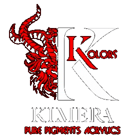

# Kimera Kolors

|Name|Code|Set|R|G|B|Hex|
|---|---|---|---|---|---|---|
|Alizarin Crimson|PR 179|Kimera Kolors Expansion Set 1|98|25|47| `#62192F`|
|Carbon Black|PBK7|Kimera Kolors Pure Pigments|45|42|45| `#2D2A2D`|
|Cartacci Red|null|Kimera Kolors Danilo Cartacci Signature Set|208|44|42| `#D02C2A`|
|Caucasian Skintone|null|Kimera Kolors Danilo Cartacci Signature Set|194|131|92| `#C2835C`|
|Cloudy Sky|null|Kimera Kolors Michal Pisarski Signature Set|169|158|133| `#A99E85`|
|Cobalt Bluegreen|PB 36|Kimera Kolors Expansion Set 1|40|94|104| `#285E68`|
|Cold Yellow|PY151|Kimera Kolors Pure Pigments|229|216|40| `#E5D828`|
|Dark Ochre|PBR 48|Kimera Kolors Expansion Set 1|149|107|35| `#956B23`|
|Diarylide Yellow|PY 170|Kimera Kolors Expansion Set 1|234|163|57| `#EAA339`|
|Fallen Grass|null|Kimera Kolors Michal Pisarski Signature Set|111|124|99| `#6F7C63`|
|Golden Brown|null|Kimera Kolors Danilo Cartacci Signature Set|136|90|30| `#885A1E`|
|Ground Brown|null|Kimera Kolors Michal Pisarski Signature Set|84|72|60| `#54483C`|
|Honey Moon Yellow|PBR 24|Kimera Kolors Expansion Set 1|199|145|49| `#C79131`|
|Iron Hue|null|Kimera Kolors Michal Pisarski Signature Set|117|121|115| `#757973`|
|Kiwi Brown|null|Kimera Kolors Danilo Cartacci Signature Set|102|91|40| `#665B28`|
|Magenta|PR122|Kimera Kolors Pure Pigments|161|25|91| `#A1195B`|
|Mars Orange|PR 101|Kimera Kolors Expansion Set 1|154|86|34| `#9A5622`|
|Morning Sky|null|Kimera Kolors Michal Pisarski Signature Set|93|132|153| `#5D8499`|
|Orange|PO34|Kimera Kolors Pure Pigments|203|85|46| `#CB552E`|
|Oxide Brown Dark|PBR 11 Dark|Kimera Kolors Expansion Set 1|75|50|41| `#4B3229`|
|Oxide Brown Light|PBR 11 Light|Kimera Kolors Expansion Set 1|125|91|68| `#7D5B44`|
|Oxide Brown Medium|PBR 11 Medium|Kimera Kolors Expansion Set 1|107|72|66| `#6B4842`|
|Oxide Green|PG 17|Kimera Kolors Expansion Set 1|80|108|72| `#506C48`|
|Phtalo Green|PG7|Kimera Kolors Pure Pigments|52|76|80| `#344C50`|
|Phthalo Blu (Green Shade)|PB15.4|Kimera Kolors Pure Pigments|32|52|121| `#203479`|
|Phthalo Blu (Red Shade)|PB15.2|Kimera Kolors Pure Pigments|68|48|123| `#44307B`|
|Purple|PV 19|Kimera Kolors Expansion Set 1|135|33|122| `#87217A`|
|Red Oxide|PR101|Kimera Kolors Pure Pigments|107|47|12| `#6B2F0C`|
|Royal Brown|PBR 25|Kimera Kolors Expansion Set 1|101|39|29| `#65271D`|
|Samurai Green|null|Kimera Kolors Danilo Cartacci Signature Set|48|110|100| `#306E64`|
|Silver Grey|null|Kimera Kolors Danilo Cartacci Signature Set|120|131|136| `#788388`|
|Sun Ray|null|Kimera Kolors Michal Pisarski Signature Set|253|246|173| `#FDF6AD`|
|The Red|PR170|Kimera Kolors Pure Pigments|168|33|53| `#A82135`|
|The White|PW6|Kimera Kolors Pure Pigments|228|228|228| `#E4E4E4`|
|Toluidine Red|PR 3|Kimera Kolors Expansion Set 1|213|80|43| `#D5502B`|
|Ultramarine Blue|PB 29|Kimera Kolors Expansion Set 1|46|73|147| `#2E4993`|
|Violet|PV23|Kimera Kolors Pure Pigments|62|15|127| `#3E0F7F`|
|Warm Yellow|PY83|Kimera Kolors Pure Pigments|230|169|29| `#E6A91D`|
|Yellow Oxide|PY42|Kimera Kolors Pure Pigments|198|152|37| `#C69825`|

Made available by <a href="https://miniaturepainterpro.app/">Miniature Painter Pro</a>

