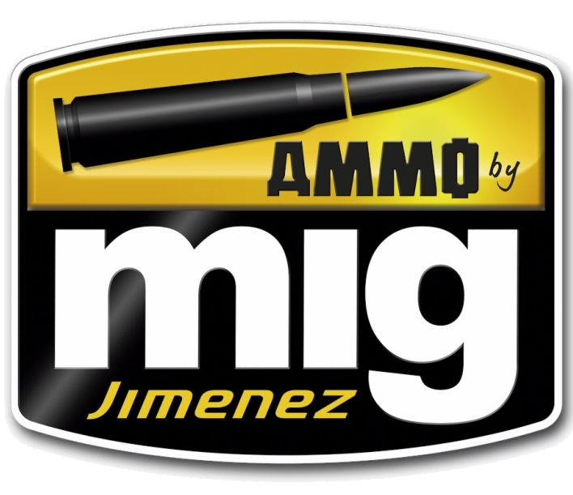

# Mig

|Name|Code|Set|R|G|B|Hex|
|---|---|---|---|---|---|---|
| Sand Yellow|AMIG0030|Acrylics|216|166|79| `#D8A64F`|
|3b Au Basic Protector Alkidno-uretanovaya|AMIG0022|Acrylics|61|51|26| `#3D331A`|
|4bo Russian Green|AMIG0019|Acrylics|79|81|41| `#4F5129`|
|6k Russian Brown|AMIG0020|Acrylics|59|49|40| `#3B3128`|
|7k Russian Tan|AMIG0021|Acrylics|112|96|62| `#70603E`|
|Afrika Korps Wash|AMIG1001|Washes|50|42|29| `#322A1D`|
|Apc Interior Light Green|AMIG0082|Acrylics|141|161|134| `#8DA186`|
|Basic Skin Tone|AMIG0116|Acrylics|227|180|164| `#E3B4A4`|
|Black Wash|AMIG1011|Washes|14|14|14| `#0E0E0E`|
|Blood Red|AMIG0121|Acrylics|172|43|37| `#AC2B25`|
|Blue (RAL 5019)|AMIG0086|Acrylics|27|79|136| `#1B4F88`|
|Blue Green|AMIG0069|Acrylics|40|60|35| `#283C23`|
|Blue Wash For Panzer Grey|AMIG1006|Washes|31|36|42| `#1F242A`|
|Bluish Titanium|AMIG0193|Acrylics|97|145|133| `#619185`|
|Bone|AMIG0122|Acrylics|237|238|220| `#EDEEDC`|
|Brass|AMIG0197|Acrylics|183|136|28| `#B7881C`|
|Bright Green Amt-4|AMIG0080|Acrylics|94|125|58| `#5E7D3A`|
|Brown Soil|AMIG0076|Acrylics|110|73|57| `#6E4939`|
|Brown Wash For German Dark Yellow|AMIG1000|Washes|66|50|34| `#423222`|
|Burnt Brown Red|AMIG0134|Acrylics|53|32|5| `#352005`|
|Burnt Sand|AMIG0118|Acrylics|126|90|58| `#7E5A3A`|
|Chipping|AMIG0044|Acrylics|38|14|14| `#260E0E`|
|Cinnamon |AMIG0135|Acrylics|147|125|111| `#937D6F`|
|Clay Brown|AMIG0079|Acrylics|104|63|35| `#683F23`|
|Cold Gray|AMIG0119|Acrylics|211|211|211| `#D3D3D3`|
|Copper|AMIG0199|Acrylics|201|74|93| `#C94A5D`|
|Crystal Black Blue|AMIG0099|Acrylics|2|35|52| `#022334`|
|Crystal Glass|AMIG0094|Acrylics|167|167|167| `#A7A7A7`|
|Crystal Green|AMIG0092|Acrylics|45|68|16| `#2D4410`|
|Crystal Light Blue|AMIG0098|Acrylics|7|132|190| `#0784BE`|
|Crystal Orange|AMIG0097|Acrylics|254|143|0| `#FE8F00`|
|Crystal Periscope Green|AMIG0096|Acrylics|64|119|15| `#40770F`|
|Crystal Red|AMIG0093|Acrylics|89|22|16| `#591610`|
|Crystal Smoke|AMIG0095|Acrylics|19|30|24| `#131E18`|
|Cyan|AMIG0128|Acrylics|36|149|251| `#2495FB`|
|Dark Brown Wash For Green Vehicles|AMIG1005|Washes|29|14|11| `#1D0E0B`|
|Dark Green (bs 241)|AMIG0915|Acrylics|69|83|48| `#455330`|
|Dark Rust|AMIG0041|Acrylics|137|59|36| `#893B24`|
|Dark Tracks|AMIG0035|Acrylics|19|7|7| `#130707`|
|Dark Wash|AMIG1008|Washes|23|19|16| `#171310`|
|Deep Green|AMIG0052|Acrylics|11|86|45| `#0B562D`|
|Desert Yellow|AMIG0138|Acrylics|184|153|109| `#B8996D`|
|Duck Egg Green (bs 216)|AMIG0244|Acrylics|175|185|133| `#AFB985`|
|Dull Green|AMIG0077|Acrylics|61|89|90| `#3D595A`|
|Dunkelgelb Base|AMIG0902|Acrylics|142|129|74| `#8E814A`|
|Dunkelgelb Dark Base|AMIG0901|Acrylics|123|107|55| `#7B6B37`|
|Dunkelgelb High Light|AMIG0904|Acrylics|208|206|147| `#D0CE93`|
|Dunkelgelb Light Base|AMIG0903|Acrylics|183|171|121| `#B7AB79`|
|Dunkelgelb Shadow|AMIG0900|Acrylics|56|27|32| `#381B20`|
|Dunkelgelb Shine|AMIG0905|Acrylics|226|225|197| `#E2E1C5`|
|Dunkelgrau Base|AMIG0908|Acrylics|51|53|66| `#333542`|
|Dunkelgrau Dark Base|AMIG0907|Acrylics|71|73|86| `#474956`|
|Dunkelgrau Light Base|AMIG0909|Acrylics|105|109|118| `#696D76`|
|Dunkelgrau Shadow|AMIG0906|Acrylics|50|51|53| `#323335`|
|Dust|AMIG0072|Acrylics|150|140|113| `#968C71`|
|Earth|AMIG0073|Acrylics|116|87|57| `#745739`|
|Earth Brown|AMIG0064|Acrylics|129|68|40| `#814428`|
|Faded Sinai Grey|AMIG0066|Acrylics|115|108|90| `#736C5A`|
|Faded Yellow|AMIG0130|Acrylics|216|205|115| `#D8CD73`|
|Forest Green|AMIG0065|Acrylics|56|69|39| `#384527`|
|French Blue|AMIG0062|Acrylics|68|83|102| `#445366`|
|Fs 15102 Dark Gray Blue|AMIG0229|Acrylics|36|137|189| `#2489BD`|
|Fs 23070 Dark Olive Drab|AMIG0237|Acrylics|108|104|69| `#6C6845`|
|Fs 24277 Green|AMIG0213|Acrylics|107|135|120| `#6B8778`|
|Fs 25042 Sea Blue (ana 606)|AMIG0227|Acrylics|33|38|44| `#21262C`|
|Fs 26231 (bs 638)|AMIG0205|Acrylics|113|115|127| `#71737F`|
|Fs 26373 Silver Grey|AMIG0212|Acrylics|146|162|162| `#92A2A2`|
|Fs 30219 Tan|AMIG0202|Acrylics|129|96|61| `#81603D`|
|Fs 33446 US Modern Vehicles|AMIG0025|Acrylics|199|167|128| `#C7A780`|
|Fs 33481 Zinc Chromate Yellow|AMIG0221|Acrylics|177|152|70| `#B19846`|
|Fs 33531 Middlestone|AMIG0200|Acrylics|214|199|180| `#D6C7B4`|
|Fs 34086 (ana 613)|AMIG0240|Acrylics|63|64|46| `#3F402E`|
|Fs 34092 Medium Green|AMIG0238|Acrylics|58|82|58| `#3A523A`|
|Fs 34151 Zinc Chromate Green (interior Green)|AMIG0220|Acrylics|102|110|69| `#666E45`|
|Fs 34226 (bs283) Interior Green|AMIG0219|Acrylics|114|145|130| `#729182`|
|Fs 34424 Light Gray Green|AMIG0201|Acrylics|177|202|170| `#B1CAAA`|
|Fs 35164 Intermediate Blue (ana 608)|AMIG0228|Acrylics|112|121|128| `#707980`|
|Fs 36118 Medium Gunship Gray|AMIG0204|Acrylics|63|69|81| `#3F4551`|
|Fs 36122 NeutRAL Gray|AMIG0239|Acrylics|103|104|108| `#67686C`|
|Fs 36270 Medium Gray|AMIG0211|Acrylics|153|153|155| `#99999B`|
|Fs 36293|AMIG0236|Acrylics|127|132|135| `#7F8487`|
|Fs 36314 (bs 626)|AMIG0207|Acrylics|131|151|140| `#83978C`|
|Fs 36320 Dark Compass Ghost Gray|AMIG0208|Acrylics|112|135|141| `#70878D`|
|Fs 36375 Light Compass Ghost Gray|AMIG0203|Acrylics|131|144|163| `#8390A3`|
|Fs 36440 Light Gull Gray|AMIG0241|Acrylics|149|154|148| `#959A94`|
|Fs 36495 Light Gray|AMIG0209|Acrylics|166|183|173| `#A6B7AD`|
|Fs 36622 Gray|AMIG0226|Acrylics|209|210|194| `#D1D2C2`|
|Fs 37886|AMIG0242|Acrylics|240|240|216| `#F0F0D8`|
|Fs35237 Blue Gray Amt-11|AMIG0210|Acrylics|109|125|138| `#6D7D8A`|
|Fs35260 Sky Line Blue A II |AMIG0224|Acrylics|113|198|227| `#71C6E3`|
|Fs36152 Dark Grey AMT-12|AMIG0235|Acrylics|93|98|104| `#5D6268`|
|Gold|AMIG0198|Acrylics|184|176|33| `#B8B021`|
|Gold Yellow (RLM 04 Gelb)|AMIG0125|Acrylics|215|192|18| `#D7C012`|
|Green Base|AMIG0916|Acrylics|78|99|56| `#4E6338`|
|Green Khaki|AMIG0056|Acrylics|84|80|53| `#545035`|
|Green Moss|AMIG0074|Acrylics|106|104|55| `#6A6837`|
|Green Slate (RLM 02)|AMIG0217|Acrylics|42|56|30| `#2A381E`|
|Grey|AMIG0059|Acrylics|129|133|142| `#81858E`|
|Grey Brown Amt-1|AMIG0252|Acrylics|130|123|113| `#827B71`|
|Grey High Light|AMIG0910|Acrylics|125|128|135| `#7D8087`|
|Grey Shine|AMIG0911|Acrylics|162|165|172| `#A2A5AC`|
|Gun Metal|AMIG0045|Acrylics|82|80|68| `#525044`|
|Idf Green|AMIG0068|Acrylics|86|84|46| `#56542E`|
|Interior Turquoise Green|AMIG0223|Acrylics|28|131|104| `#1C8368`|
|Interiors Wash|AMIG1003|Washes|60|50|41| `#3C3229`|
|Jet Exhaust Burnt Iron|AMIG0187|Acrylics|62|36|23| `#3E2417`|
|Khaki|AMIG0071|Acrylics|115|85|51| `#735533`|
|Khaki Brown|AMIG0088|Acrylics|179|146|103| `#B39267`|
|Khaki Green Nº3 (british 1939-42)|AMIG0113|Acrylics|104|95|56| `#685F38`|
|Light Blue |AMIG0249|Acrylics|180|206|219| `#B4CEDB`|
|Light Brown-gray|AMIG0120|Acrylics|214|209|206| `#D6D1CE`|
|Light Green|AMIG0917|Acrylics|147|175|117| `#93AF75`|
|Light Green Khaki|AMIG0058|Acrylics|124|123|77| `#7C7B4D`|
|Light Green Khv-553m|AMIG0051|Acrylics|165|187|138| `#A5BB8A`|
|Light Rust|AMIG0039|Acrylics|229|145|11| `#E5910B`|
|Light Rust Wash|AMIG1004|Washes|85|46|17| `#552E11`|
|Light Sand Grey|AMIG0067|Acrylics|184|166|128| `#B8A680`|
|Light Skin Tone|AMIG0115|Acrylics|238|202|168| `#EECAA8`|
|Light Wood|AMIG0038|Acrylics|187|170|127| `#BBAA7F`|
|Lime Green|AMIG0124|Acrylics|16|159|69| `#109F45`|
|Marine Blue|AMIG0123|Acrylics|24|86|143| `#18568F`|
|Matt Aluminum|AMIG0194|Acrylics|170|188|176| `#AABCB0`|
|Matt Black|AMIG0046|Acrylics|19|19|19| `#131313`|
|Matt Varnish|AMIG0089|Acrylics|254|254|254| `#FEFEFE`|
|Matt White|AMIG0050|Acrylics|252|254|251| `#FCFEFB`|
|Medium Blue|AMIG0103|Acrylics|41|72|136| `#294888`|
|Medium Brown Dark Earth (bs 450)|AMIG0070|Acrylics|82|54|40| `#523628`|
|Medium Rust|AMIG0040|Acrylics|184|84|48| `#B85430`|
|Medium Sea Grey (bs 637)|AMIG0246|Acrylics|133|143|145| `#858F91`|
|Metallic Orange|AMIG0189|Acrylics|205|103|2| `#CD6702`|
|Metallic Red|AMIG0188|Acrylics|193|56|40| `#C13828`|
|Nato Brown|AMIG0085|Acrylics|65|44|39| `#412C27`|
|Nato Green|AMIG0084|Acrylics|66|71|51| `#424733`|
|Neutral Wash|AMIG1010|Washes|80|80|80| `#505050`|
|New  Wood|AMIG0037|Acrylics|193|171|114| `#C1AB72`|
|New Iraqui Army Sand|AMIG0029|Acrylics|200|175|118| `#C8AF76`|
|Night Blue Grey|AMIG0250|Acrylics|82|86|98| `#525662`|
|Ocean Grey (bs 629)|AMIG0245|Acrylics|98|107|114| `#626B72`|
|Ochre Brown|AMIG0102|Acrylics|158|131|86| `#9E8356`|
|Ochre Earth|AMIG0078|Acrylics|194|142|92| `#C28E5C`|
|Oil Ochre|AMIG0055|Acrylics|206|173|80| `#CEAD50`|
|Old Brass|AMIG0190|Acrylics|129|97|22| `#816116`|
|Old Rust|AMIG0042|Acrylics|69|38|33| `#452621`|
|Old Wood|AMIG0036|Acrylics|191|171|138| `#BFAB8A`|
|Olive Drab  Base|AMIG0926|Acrylics|82|79|46| `#524F2E`|
|Olive Drab  High Lights|AMIG0928|Acrylics|121|118|83| `#797653`|
|Olive Drab  Light Base|AMIG0927|Acrylics|104|101|66| `#686542`|
|Olive Drab Shadow|AMIG0924|Acrylics|50|48|23| `#323017`|
|Olive Drab Shine|AMIG0929|Acrylics|137|135|97| `#898761`|
|One Shot Primer - Black|AMIG2023|Primers|24|24|24| `#181818`|
|One Shot Primer - Brown Oxide|AMIG2026|Primers|65|32|23| `#412017`|
|One Shot Primer - Green|AMIG2028|Primers|38|52|39| `#263427`|
|One Shot Primer - Grey|AMIG2024|Primers|107|107|107| `#6B6B6B`|
|One Shot Primer - Sand Flesh|AMIG2027|Primers|183|163|113| `#B7A371`|
|One Shot Primer - White |AMIG2022|Primers|228|228|228| `#E4E4E4`|
|Orange|AMIG0129|Acrylics|231|115|30| `#E7731E`|
|Pale Green|AMIG0060|Acrylics|58|99|39| `#3A6327`|
|Polished Metal|AMIG0192|Acrylics|91|108|92| `#5B6C5C`|
|Protective Green|AMIG0023|Acrylics|94|115|59| `#5E733B`|
|Protective Mc 1200|AMIG0053|Acrylics|24|52|27| `#18341B`|
|Purple|AMIG0127|Acrylics|145|84|164| `#9154A4`|
|RAL 6003 Olivgrün Opt.1|AMIG0001|Acrylics|53|61|38| `#353D26`|
|RAL 6003 Olivgrün Opt.2|AMIG0002|Acrylics|78|85|54| `#4E5536`|
|RAL 6011 B Resedagrün|AMIG0004|Acrylics|82|93|51| `#525D33`|
|RAL 6011 Resedagrün|AMIG0003|Acrylics|103|125|76| `#677D4C`|
|RAL 6014 Gelboliv|AMIG0087|Acrylics|69|71|50| `#454732`|
|RAL 7008 Graugrün|AMIG0005|Acrylics|98|89|60| `#62593C`|
|RAL 7008 Graugrün Opt.2|AMIG0006|Acrylics|138|133|77| `#8A854D`|
|RAL 7017 Dunkelbraun|AMIG0007|Acrylics|82|66|50| `#524232`|
|RAL 7021 Dunkelgrau|AMIG0008|Acrylics|39|43|52| `#272B34`|
|RAL 7027 Sandgrau|AMIG0009|Acrylics|192|175|147| `#C0AF93`|
|RAL 7028 Dunkelgelb (mid War)|AMIG0010|Acrylics|164|148|63| `#A4943F`|
|RAL 7028 Dunkelgelb AUS ’44 Dg I|AMIG0011|Acrylics|201|190|134| `#C9BE86`|
|RAL 7028 Dunkelgelb AUS ’44 Dg IIi|AMIG0012|Acrylics|215|206|165| `#D7CEA5`|
|RAL 8000 Gelbbraun|AMIG0013|Acrylics|174|149|118| `#AE9576`|
|RAL 8012 Rotbraun|AMIG0014|Acrylics|133|50|10| `#85320A`|
|RAL 8017 Schokobraun|AMIG0015|Acrylics|80|49|44| `#50312C`|
|RAL 8020 Gelbbraun|AMIG0016|Acrylics|231|202|122| `#E7CA7A`|
|RAL 8031 F9 Sand Brown|AMIG0026|Acrylics|205|163|139| `#CDA38B`|
|RAL 9001 Cremeweiss|AMIG0017|Acrylics|242|239|194| `#F2EFC2`|
|RAL1039 F9 German Sand Beige|AMIG0027|Acrylics|198|176|116| `#C6B074`|
|RAL7050 F7 German Grey Beige|AMIG0028|Acrylics|128|120|99| `#807863`|
|RLM 65 Hellblau|AMIG0231|Acrylics|199|219|226| `#C7DBE2`|
|RLM 66 Schwartzgrau|AMIG0218|Acrylics|40|43|52| `#282B34`|
|RLM 70 Schwartzgrün|AMIG0232|Acrylics|51|60|43| `#333C2B`|
|RLM 71 Dunkelgrün|AMIG0233|Acrylics|81|86|63| `#51563F`|
|RLM 74 Graugrün|AMIG0253|Acrylics|67|78|72| `#434E48`|
|RLM 75 Grauviolett|AMIG0254|Acrylics|124|126|123| `#7C7E7B`|
|RLM 76 Pale Grey|AMIG0063|Acrylics|154|196|182| `#9AC4B6`|
|RLM 78 Hellblau|AMIG0247|Acrylics|129|155|156| `#819B9C`|
|RLM 79 Sandgelb|AMIG0222|Acrylics|197|153|66| `#C59942`|
|RLM 80 Olivgrün|AMIG0248|Acrylics|59|73|48| `#3B4930`|
|RLM 81|AMIG0206|Acrylics|71|81|44| `#47512C`|
|RLM 81 Braunviolett|AMIG0255|Acrylics|85|60|55| `#553C37`|
|RLM 81 Olive Drab Dark|AMIG0925|Acrylics|65|61|32| `#413D20`|
|RLM 82 Camo Green|AMIG0230|Acrylics|62|62|0| `#3E3E00`|
|RLM 84 Graublau|AMIG0256|Acrylics|185|185|123| `#B9B97B`|
|Real Idf Sand Grey 73|AMIG0132|Acrylics|132|121|75| `#84794B`|
|Real Idf Sinai Grey 82|AMIG0131|Acrylics|83|79|42| `#534F2A`|
|Red|AMIG0049|Acrylics|189|38|21| `#BD2615`|
|Red Brown Base|AMIG0913|Acrylics|107|50|30| `#6B321E`|
|Red Brown Light|AMIG0914|Acrylics|158|83|64| `#9E5340`|
|Red Brown Shadow|AMIG0912|Acrylics|66|29|20| `#421D14`|
|Red Leather|AMIG0133|Acrylics|100|59|41| `#643B29`|
|Red Primer  High Lights|AMIG0922|Primers|127|61|26| `#7F3D1A`|
|Red Primer  Shine|AMIG0923|Primers|158|89|34| `#9E5922`|
|Red Primer Base|AMIG0920|Primers|73|20|4| `#491404`|
|Red Primer Dark Base|AMIG0919|Primers|89|59|35| `#593B23`|
|Red Primer Light Base|AMIG0921|Primers|99|37|12| `#63250C`|
|Red Primer Shadow|AMIG0918|Primers|50|24|25| `#321819`|
|Reddish Earth|AMIG0139|Acrylics|112|84|70| `#705446`|
|Rubber &amp; Tires|AMIG0033|Acrylics|61|56|60| `#3D383C`|
|Russian Blue Amt-7|AMIG0251|Acrylics|47|115|126| `#2F737E`|
|Russian Dark Base|AMIG0931|Acrylics|74|79|39| `#4A4F27`|
|Russian Green Base|AMIG0932|Acrylics|93|92|25| `#5D5C19`|
|Russian High Light|AMIG0934|Acrylics|140|133|87| `#8C8557`|
|Russian Light Base|AMIG0933|Acrylics|121|114|68| `#797244`|
|Russian Shadow|AMIG0930|Acrylics|48|48|14| `#30300E`|
|Russian Shine|AMIG0935|Acrylics|158|151|109| `#9E976D`|
|Rust Tracks|AMIG0034|Acrylics|56|38|28| `#38261C`|
|Satin Black|AMIG0032|Acrylics|28|28|28| `#1C1C1C`|
|Satin White|AMIG0047|Acrylics|232|232|232| `#E8E8E8`|
|Scc 15 (british 1944-45 Olive Drab)|AMIG0112|Acrylics|53|59|25| `#353B19`|
|Scc 1a  (british Brown 1941-42)|AMIG0110|Acrylics|53|33|24| `#352118`|
|Scc 2 (british 1941-44 Service Drab)|AMIG0111|Acrylics|84|73|51| `#544933`|
|Shadow Rust|AMIG0043|Acrylics|51|23|22| `#331716`|
|Signal Green|AMIG0054|Acrylics|40|129|45| `#28812D`|
|Silver|AMIG0195|Acrylics|198|209|193| `#C6D1C1`|
|Sky Type S (bs 210)|AMIG0243|Acrylics|180|178|153| `#B4B299`|
|Spanish Green-khaki|AMIG0031|Acrylics|80|71|40| `#504728`|
|Starship Wash|AMIG1009|Washes|15|11|10| `#0F0B0A`|
|Steel|AMIG0191|Acrylics|183|194|177| `#B7C2B1`|
|Stone Grey|AMIG0075|Acrylics|178|178|178| `#B2B2B2`|
|Tracks Wash|AMIG1002|Washes|26|18|15| `#1A120F`|
|US Modern Vehicles Wash|AMIG1007|Washes|90|74|61| `#5A4A3D`|
|US Olive Drab Vietnam Era (fs 24087)|AMIG0081|Acrylics|66|74|53| `#424A35`|
|Violet|AMIG0126|Acrylics|86|67|156| `#56439C`|
|Waffen Ss|AMIG0018|Acrylics|66|104|91| `#42685B`|
|Warhead Metallic Blue|AMIG0196|Acrylics|35|126|233| `#237EE9`|
|Warm Sand-yellow|AMIG0061|Acrylics|215|182|87| `#D7B657`|
|Warm Skin Tone|AMIG0117|Acrylics|181|135|111| `#B5876F`|
|Washable Black|AMIG0104|Acrylics|0|0|0| `#000000`|
|Washable Dust (RAL 8000)|AMIG0105|Acrylics|157|129|82| `#9D8152`|
|Washable Earth|AMIG0107|Acrylics|113|77|53| `#714D35`|
|Washable Mud|AMIG0108|Acrylics|83|50|41| `#533229`|
|Washable Rust|AMIG0109|Acrylics|160|64|42| `#A0402A`|
|Washable Sand (RAL 8020)|AMIG0106|Acrylics|192|152|83| `#C09853`|
|Washable White Camo|AMIG0024|Acrylics|250|251|246| `#FAFBF6`|
|Xb-518 Zashchitniy Zeleno (russian Postwar Green)|AMIG0083|Acrylics|78|79|48| `#4E4F30`|
|Yellow|AMIG0048|Acrylics|235|195|11| `#EBC30B`|
|Yellow Grey|AMIG0057|Acrylics|201|182|142| `#C9B68E`|
|Zimmerit Ochre Color|AMIG0114|Acrylics|154|139|118| `#9A8B76`|

Made available by <a href="https://miniaturepainterpro.app/">Miniature Painter Pro</a>

